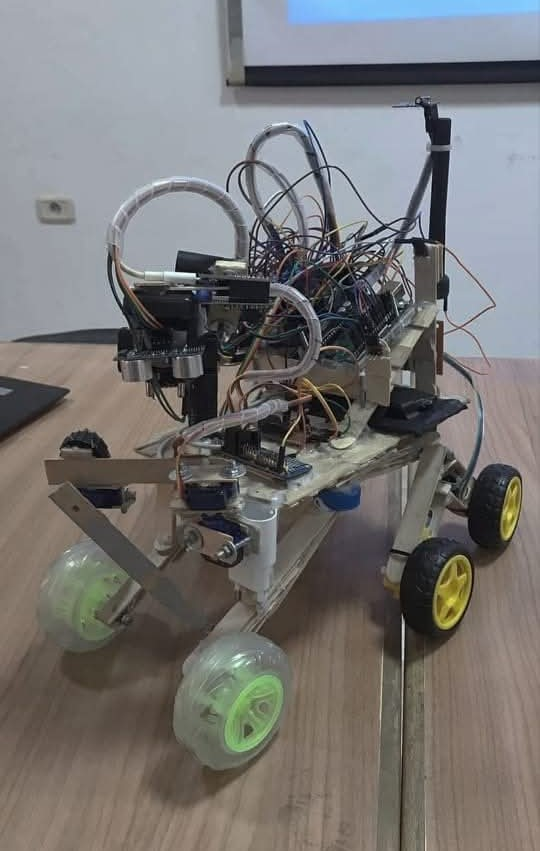
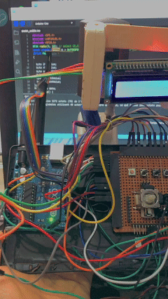
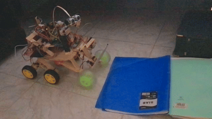
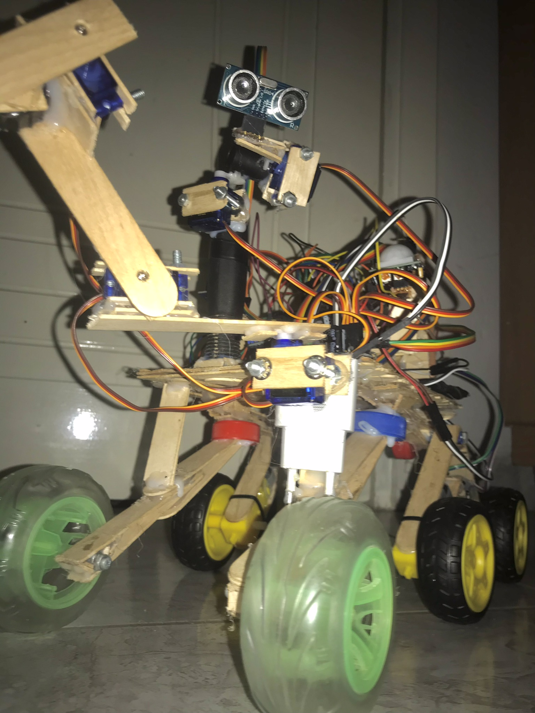
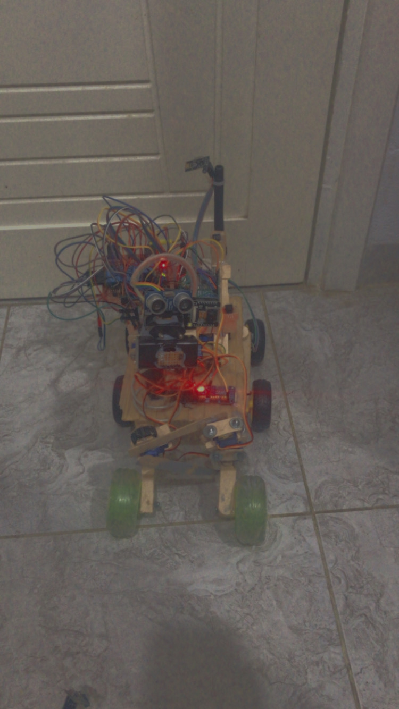

# Nova – The Explorer Robot 🚀  

*Inspired by NASA’s Perseverance Mars Rover*  

Nova brings a taste of Mars exploration to Earth, combining **wireless control**, **obstacle detection**, and a **multi-DOF robotic arm**.



---

## Project Overview  

Nova is a **6-wheeled rover** featuring:  
- Wireless control via **nRF24L01**  
- Dual Arduino boards (rover + remote)  
- Real-time feedback from **ultrasonic** and **DIR motion sensor**  
- Robotic arm with **3 servos (2 DOF)**  
- Head with **2 servos for 360° ultrasonic + camera rotation**  
- LCD on the remote showing **distance** + **motion detection**  
- **ESP32-CAM Wi-Fi camera** (separate from Arduino, streams video over Wi-Fi)  

Inspired by **NASA’s Perseverance Rover**, Nova uses a semi rocker-bogie-like concept for stability.

---

## Key Specifications

| Feature | Details |
|--------|---------|
| **Chassis** | 6-wheel platform (4 motorized, 2 free) |
| **Drive System** | 4 DC motors + H-bridge relays + frequency-modulated speed control |
| **Robotic Arm** | 3 servos, 2 DOF |
| **Head System** | 2 servos (360° rotation) |
| **Sensors** | Ultrasonic distance + DIR motion sensor |
| **Camera** | ESP32-CAM Wi-Fi camera (separate from Arduino system) |
| **Wireless** | nRF24L01 bidirectional link |
| **Servo Driver** | PCA9685 via I2C |
| **Power** | Separated power rails for motors, servos, electronics |
| **Code** | All Arduino and ESP32 code available in the `code/` folder |

---

## Electronics & Wiring

- **DC Motors:** Controlled via H-bridge relays; speed is reduced by opening/closing relays at a specific frequency to minimize current.  
- **Servos:** Head and arm servos connected to **PCA9685 PWM driver** via I2C for precise movement.  
- **Sensors:**  
  - **Ultrasonic sensor:** Measures distance and sends it to the LCD.  
  - **DIR motion sensor:** Detects motion and updates the LCD.  
- **Wireless:** nRF24L01 modules send commands from remote to rover and send sensor feedback back to the remote.  
- **Camera:** **ESP32-CAM** streams video independently via Wi-Fi; it is not connected to Arduino, ensuring seamless video streaming.  

### Text-Based Circuit Diagram

Motors (4 DC):
Left Side:
Motor1 -> Relay1 (IN1, IN2)
Motor2 -> Relay2 (IN3, IN4)
Right Side:
Motor3 -> Relay3 (IN5, IN6)
Motor4 -> Relay4 (IN7, IN8)
Relays -> Arduino digital pins

Servos:
Arm Servos (3) -> PCA9685
Head Servos (2) -> PCA9685
PCA9685 -> Arduino (SDA, SCL)

Sensors:
Ultrasonic:
TRIG -> Arduino pin
ECHO -> Arduino pin
DIR Motion Sensor:
OUT -> Arduino pin

Wireless (nRF24L01):
CE, CSN -> Arduino pins
MOSI, MISO, SCK -> SPI pins

LCD:
RS, EN, D4-D7 -> Arduino pins

Power:
Motors -> 5–6V battery
Servos -> 5–6V battery
Arduino + RF -> regulated 5V

yaml
Copy code

---

## Features
- Wireless control with real-time LCD feedback  
- Arm with 2 DOF for object manipulation  
- Head with 360° sensor rotation  
- Speed-controlled motors via relay modulation  
- Push-button functions: flash light, arm control  
- Modular design for future upgrades  
- **ESP32-CAM Wi-Fi camera** provides live video streaming independently  

---
## 📷 ESP32-CAM Camera System

(See first picture — the rover’s head module contains the mounted camera)
The ESP32-CAM handles real-time video streaming over Wi-Fi and functions separately from the Arduino system. This makes the camera lightweight, responsive, and fully autonomous, without consuming Arduino pins or processing power.
The ESP32-CAM code is available in the repository here: /code 

🔧 How the Camera Integrates Into Nova

The camera uses Wi-Fi streaming, not RF or Arduino serial.

It is powered directly from the rover’s 5V supply.

It does not communicate with the Arduino UNO — the video feed is accessed from a smartphone or computer through the ESP32-CAM's IP address.

This makes the rover modular:

Arduino handles motors + sensors

nRF24L01 handles wireless control

ESP32-CAM handles streaming independently

🛠️ Installing ESP32-CAM Support (Arduino IDE)

To upload firmware to the ESP32-CAM AI-Thinker board, follow these exact steps:

1️⃣ Install the ESP32 Board Manager

Open Arduino IDE

Go to:
File → Preferences

Under Additional Boards Manager URLs, add:

https://dl.espressif.com/dl/package_esp32_index.json


Go to:
Tools → Board → Boards Manager

Search for “ESP32”

Install esp32 by Espressif Systems


🚀 Uploading the Code

Connect the wiring exactly as above.

Select the board:
Tools → Board → ESP32 Arduino → AI Thinker ESP32-CAM

Select the port of the Arduino UNO.

Press Upload.

When “Connecting…” appears:

Press RESET on the ESP32-CAM (if your board has it)

Or unplug/plug 5V once

After upload:

Disconnect IO0 from GND

Press RESET again

The camera will boot normally

🌐 Viewing the Video Stream

The code in /code/esp32cam/ automatically launches a local Wi-Fi access point or connects to your Wi-Fi (depending on configuration).

After the ESP32-CAM boots:

Open Serial Monitor at 115200 baud

It prints the streaming URL, usually something like:

http://192.168.4.1/


Open this link in any browser to view the real-time camera stream.


## Algorithm Overview

### Rover Logic
1. Read **ultrasonic distance**  
2. Read **DIR motion sensor**  
3. Receive **remote commands**  
4. Control motor speed via **relay frequency modulation**  
5. Control servos (head + arm)  
6. Send sensor data back  
7. Repeat every **250 ms**

### Remote Logic
1. Read analog sticks  
2. Read push buttons  
3. Update LCD  
4. Send command packets every **250 ms**

---

## Example C++ Pseudocode — Rover

```cpp
#include <SPI.h>
#include <nRF24L01.h>
#include <RF24.h>
#include <Servo.h>

// Setup RF24, Ultrasonic, DIR, Motors, Servos
void setup() {
  initMotors();
  initServos();
  initSensors(); // Ultrasonic + DIR
  radio.begin();
}

// Main Loop
void loop() {
  readSensors();           // Ultrasonic + DIR
  receiveRadioCommands();  // Movement + arm/head control
  controlMotors();         // Relay-based motor control
  moveArmHead();           // PCA9685 servos
  sendSensorData();        // Back to remote
  delay(250);              // 4 Hz update rate
}
```  
## Example C++ Pseudocode — Remote

``` cpp
Copy code
#include <SPI.h>
#include <nRF24L01.h>
#include <RF24.h>
#include <LiquidCrystal.h>

// Setup RF24, LCD, Analog sticks, Buttons
void setup() {
  initRemoteInputs();
  lcd.begin(16, 2);
  radio.begin();
}

void loop() {
  readAnalogSticks();
  readPushButtons();
  displayStatusLCD();     // Distance + motion
  sendRadioCommands();    // Rover control
  delay(250);             // 4 Hz update rate
}
``` 
 🎮 Remote Controller Demo :




🛞 Semi Rocker-Bogie system Test :





### Front View



### upper View



Future Enhancements:
Autonomous navigation

Camera-based object recognition

Inverse kinematics for arm manipulation

Extended battery monitoring

Additional sensors for terrain adaptation

Notes
Rover and camera systems are separate

Two analog sticks: one for rover, one for head/arm

Multiple relays control speed via frequency modulation

Arduino + ESP32 code is in the code/ folder
